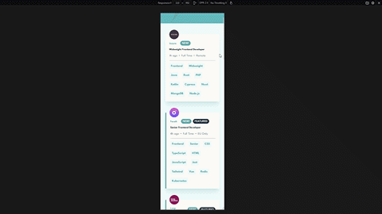

# Frontend Mentor - Job listings with filtering solution

This is a solution to the [Job listings with filtering challenge on Frontend Mentor](https://www.frontendmentor.io/challenges/job-listings-with-filtering-ivstIPCt). Frontend Mentor challenges help you improve your coding skills by building realistic projects.

## Table of contents

- [Overview](#overview)
  - [The challenge](#the-challenge)
  - [Screencast](#screencast)
  - [Live preview](#live-preview)
- [My process](#my-process)
  - [Step-by-step](#step-by-step)
  - [Built with](#built-with)
  - [What I learned](#what-i-learned)
  - [Remaining questions](#remaining-questions)
  - [Continued development](#continued-development)
  - [Useful resources](#useful-resources)

## Overview

### The challenge

Users should be able to:

- View the optimal layout for the site depending on their device's screen size
- See hover states for all interactive elements on the page
- Filter job listings based on the categories

#### Beyond the challenge

For this challenge, I added tons of extra features:

- Pagination
- nuqs for URL search params state management
- Query for server state synchronization
- MSW for faking an API and database
- Handle all states (empty, loading, error, success)
  - The list remains at its last successful state if a fetch error happens
- faker.js for generating mock data

### Screencast



### Live Preview

- Solution URL: [Solution on Frontend Mentor](https://www.frontendmentor.io/solutions/an-almost-real-pagination-experience-using-nuqs-query-and-msw-PhjJuiaGqd)
- Live Site URL: [Job Listing App on Netlify](https://static-job-listings-jvmdo.netlify.app/)

## My process

Time estimation: 10h | Actual time: 40h

I finished the proposed challenge in about 10h. The other 30hs I spent in cool extra features 🤓

### Step by step

1. Starting off by the most difficult layout
   - Job card (+4h30)
      - Mobile
      - Got stuck in the "flex-wrap empty space hell"
      - Desktop

2. Filters + general layout (+3h30)

3. Fake server with MSW (+1h)

4. Nuqs (+3h30)
    - Got stuck on the initial complexity of `useQueryStates` + Query integration + filtering
    - Stale query issue

5. Dataset (+1h30)
    - Generation

6. Refactor filtering (+3h)
    - Encapsulate logic and utilities in custom hooks
    - `useFilters` utilities are burning my neurons!

7. Pagination (+6h30)
    - Adapt MSW handler
    - Learn about Ark's pagination component
    - nuqs + pagination + query integration
    - styling + responsive layout
    - prefetch

8. Handle not so happy paths (+11h)
    - Loading (initial, keep old + horizontal indicator)
    - Empty (no results for filter, no results at all)
    - Scroll position
    - Debounce or abort too many sequencial pagination
    - Params set directly in URL
    - Error
        - Got stuck on `data undefined` when `error` exists
        - I want to revert to the previous data on error but it's not that simple

9. More refactoring and refinings (+6h)

10. Animation [NOT GOING]
    - Enter and exit animation for filter bar
    - jobs list height / snap scroll

### Built with

- React.js (Vite)
- nuqs
- Tanstack Query v5
- Mock Service Worker
- Ark UI
- tailwindcss
- faker.js

### What I learned

- MSW doesn't mention `@msw/data` in its docs! It's a powerful data querying library for testing

- A child element's vertical margin can affect its parent's position due to a CSS behavior called margin collapsing. This happens when there is no content, padding, or border to separate the top margin of the first child from the parent's top edge. Adding padding, border, overflow other than visible, flex or grid solves the issue.

- There is no CSS-only solution for shrink to fit the empty space left by `flex-wrap`.

- Remember: relative URL is `fetch()` is resolved relative to the current page URL, not project root.

- Remember: place `data.json` files in `public` directory (Vite) otherwise it won't be found by `fetch()`! Files in this folder won't be bundled. They will be fetched dynamically instead.

- Remember: `twMerge("...", className)` (className after defined styles) otherwise you would need to `!important`

- I ran into the situation where `URLSearchParams` was getting stale values from within `queryFn`. This happens because nuqs state update is instantaneous but URL updates are *asynchronous*. That way, when the `queryFn` is invoked, the URL search params are not fresh yet!
  - The solution is straightforward: just use the `queryKey` to build the query params instead.

- nuqs `parseAsNativeArrayOf` empty value is `[]` while `parseAsArrayOf` is `null`.

- Remember: `NaN` is falsy! You can use `parseInt(NaN || '1')`.

- Ark UI's Pagination component review:
    1. Some styling doesn't work on Tailwind? I had to set `style={{height}}`
    2. There is some weirdness going on around the sizing properties
    3. No responsive styles support
    Overall: good.

- It looks like the a11y of those headless components libraries don't include live announcements. Therefore, I'd include ARIA live myself for things like status changes. For example, the loading indicator should be announced by assistive technologies otherwise the user won't know the loading status.

- `requestAnimationFrame` fixed `scrollIntoView` not working consistently for cached page transitions.

- Remember: Query's `isPending` will be `true` only on mount if `placeholderData` is set to `keepPreviousData`.

- `keepPreviousData` will keep previous data only *while status is `pending`*. That is, if query succeeds, data is renewed; if query fails, there are two possibilities: if there is data in cache *for that query key*, it will be maintained; otherwise, data will be `undefined`. If you don't handle all cases, will be trapped in *infinite loading hell*.

- Status vs. Data: A query can be in an error status while still holding a data value.
  - Exception: if a query fails on its *first-ever attempt (initial fetch)*, there is no cached data to show, so data will be `undefined`.

- Explicit props when merging custom props with `ComponentProps`:

    ```tsx
        // DON'T DO THIS
        type JobCardProps = Job & ComponentProps<"article"> & {
            isLoading: boolean;
        };

        // DO THIS INSTEAD
        type JobCardProps = {
            job: Job;
            isLoading: boolean;
        } & ComponentProps<"article">;
    ```

- Query filters are used to... well, filter queries by keys! So, if you pass only the topmost key, say `queryClient.refetchQueries(['jobs'])`, all entries will be refetched! This is the default behavior. It's possible to apply some configuration.

#### Remaining questions

- Just... WHY?

  | Approach    | retry | `isError` behavior                                                       | rollback          | toast error | toast retry |
  | ----------- | ----- | ------------------------------------------------------------------------ | ----------------- | ----------- | ----------- |
  | `queryFn`   | false | `true` on mount $^1$; `false` afterward $^2$                             | instant           | shows       | don’t       |
  | `queryFn`   | true  | `true` on mount $^1$; `false` afterward $^2$                             | instant           | shows       | don’t       |
  | `useEffect` | true  | `true` on mount $^1$; `true` on subsequent errors                        | waits for retries | shows       | shows       |
  | `useEffect` | false | `true` on mount $^1$; `true` on subsequent errors                        | instant           | shows       | don’t       |

  $^1$ if there was an error

  $^2$ even if `queryFn` throws

### Continued development

- Add data prefetch for next page

    ```tsx
    useEffect(() => {
        queryClient.prefetchQuery(queryOptionsFactory());
        //No unnecessary prefetch is performed, but I'd turn them stable
    }, [filters, page, previousQueryKey, queryClient]); */
    ```

### Useful resources

- [Shrink to fit open issue](https://github.com/w3c/csswg-drafts/issues/191) - This helped me realize IT IS NOT POSSIBLE to make a flex container with `flex-wrap: wrap` shrink to fit its width using CSS only.

- [Breaking React Query's API on purpose](httpshttps://tkdodo.eu/blog/breaking-react-querys-api-on-purpose)

- [How to run logic onError in `QueryCache`](https://stackoverflow.com/a/76961109/21858786)
